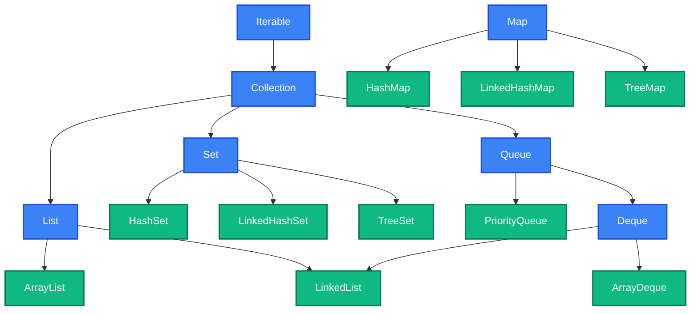

# Java for DSA

This chapter is a focused crash course on the Java features used repeatedly in DSA and coding interview preparation. Instead of covering the entire language, we will concentrate only on the parts that matter for solving problems efficiently in interviews.

## Common Imports

On LeetCode, most imports are available automatically. But when writing Java locally or in some interview platforms, you need to know what to import. Here are the imports that cover 95% of DSA problems:

```java
import java.util.*;        // ArrayList, HashMap, HashSet, Queue, PriorityQueue, etc.
import java.util.Arrays;   // Arrays.sort(), Arrays.fill(), Arrays.asList()
import java.util.Collections; // Collections.sort(), Collections.reverseOrder()
```

The wildcard `java.util.*` covers almost everything you need. In a real interview, you can write this at the top and move on. Do not waste time importing individual classes.

---

## Variables, Types, and the Overflow Trap

Java is a statically typed language, which means every variable must have a declared type. For DSA, a small set of primitive types covers most problems.

| Type | Size | Range | DSA Use Case |
| :--- | :--- | :--- | :--- |
| **int** | 4 bytes | -2.1B to 2.1B | Array indices, counters, most values |
| **long** | 8 bytes | -9.2 x 10^18 to 9.2 x 10^18 | Prefix sums, large products, overflow-prone math |
| **char** | 2 bytes | 0 to 65,535 | String characters, frequency arrays |
| **boolean** | 1 byte (JVM-dep.) | true / false | Visited arrays, flags |
| **double** | 8 bytes | ±1.7 x 10^308 | Rarely used, some geometry problems |

Each primitive type has a corresponding wrapper class (`Integer`, `Long`, `Character`, `Boolean`, `Double`) that lets you use primitives in collections. We will cover this in detail in the autoboxing section.

The most dangerous pitfall with types is integer overflow. Consider the classic binary search:

```java
// BUG: if left + right > Integer.MAX_VALUE, this overflows
int mid = (left + right) / 2;

// CORRECT: safe from overflow
int mid = left + (right - left) / 2;
```

This is not a theoretical concern. When `left` and `right` are both above 1 billion, their sum exceeds `int` range and wraps to a negative number. The safe version avoids this by computing the difference first.

### When to use `long` instead of `int`?
Use `long` in these cases:
* Prefix sums of arrays with large values (sum of 10^5 elements each up to 10^9 gives 10^14).
* Multiplication of two large ints (e.g., n * (n - 1) where n is near 10^5).
* Factorial or combination calculations.
* Modulo problems where intermediate sums can exceed `int` range before taking mod.

```java
// Overflow: 100000 * 99999 > Integer.MAX_VALUE
int wrong = n * (n - 1);

// Safe: cast to long BEFORE multiplication
long correct = (long) n * (n - 1);

// WRONG: casting AFTER multiplication is too late, overflow already happened
long stillWrong = (long)(n * (n - 1));
```

The placement of the cast matters. `(long) n * (n - 1)` first promotes `n` to `long`, then performs `long` multiplication. But `(long)(n * (n - 1))` performs `int` multiplication first (which overflows), then casts the already-corrupted result to `long`.

The ternary operator is a compact alternative to if-else for inline decisions:

```java
int result = (a > b) ? a : b;  // Same as Math.max(a, b)
String label = (count == 1) ? "item" : "items";
```

---

## Operators and Control Flow

Most operators in Java work as you would expect, but a few deserve special attention for DSA.

Modular arithmetic with `%` appears in hashing, cyclic array problems, and math-heavy questions. Remember that Java's `%` can return negative values for negative operands: `-7 % 3` gives `-1`, not `2`. To get a positive result, use `((n % m) + m) % m`.

Many problems ask you to return the result "modulo 10^9 + 7" to prevent overflow in the output. This is a standard pattern:

```java
private static final int MOD = 1_000_000_007;

// Apply modulo during computation, not just at the end
long result = 0;
for (int i = 0; i < n; i++) {
    result = (result + values[i]) % MOD;
}
return (int) result;
```

Note the underscore in `1_000_000_007`. Java allows underscores in numeric literals for readability. This is the same as writing `1000000007`, easier to read and verify.

Bitwise operators unlock an entire category of problems:

```java
// XOR trick: find the number that appears once (all others appear twice)
// nums = [4, 1, 2, 1, 2]
int single = 0;
for (int num : nums) {
    single ^= num;  // XOR cancels out duplicates
}
// single = 4
```

### Key Bitwise Operators

| Operator | Symbol | DSA Use |
| :--- | :---: | :--- |
| **AND** | `&` | Masking, checking if bit is set: `(n & (1 << i)) != 0` |
| **OR** | `\|` | Setting bits: `n \| (1 << i)` |
| **XOR** | `^` | Finding unique elements, toggling bits |
| **NOT** | `~` | Bit inversion |
| **Left shift** | `<<` | Multiply by powers of 2: `1 << n` equals 2^n |
| **Right shift** | `>>` | Divide by powers of 2 (preserves sign) |
| **Unsigned right shift** | `>>>` | Divide by powers of 2 (fills with 0) |

A common bit manipulation pattern is checking and setting individual bits, which shows up in problems using bitmasks to represent subsets:

```java
// Check if bit i is set
boolean isSet = (mask & (1 << i)) != 0;

// Set bit i
mask = mask | (1 << i);

// Clear bit i
mask = mask & ~(1 << i);

// Toggle bit i
mask = mask ^ (1 << i);

// Count number of set bits
int count = Integer.bitCount(mask);
```

Control flow in Java offers three loop forms. Use each where it fits:

```java
// Index-based for: when you need the index
for (int i = 0; i < nums.length; i++) { ... }

// Backward traversal (used in some DP and stack problems)
for (int i = n - 1; i >= 0; i--) { ... }

// Enhanced for-each: when you only need values
for (int num : nums) { ... }

// While: when the termination condition is not index-based
while (left < right) { ... }
```

One limitation to remember: the enhanced for-each loop does not give you the index, and you cannot modify the underlying collection while iterating. If you need the index or need to modify elements, use the standard `for` loop.

Short-circuit evaluation with `&&` and `||` is important for safety. Java evaluates left to right and stops as soon as the result is determined:

```java
// Safe: the second condition is only checked if the first is true
if (index < nums.length && nums[index] == target) { ... }

// Without short-circuit, this would throw ArrayIndexOutOfBoundsException
// when index >= nums.length
```

---

## Methods and Pass-by-Value

Extract logic into helper methods when it keeps your code clean. On LeetCode, your solution lives inside a class with static or instance methods.

```java
// Helper method for swapping elements in an array
private void swap(int[] arr, int i, int j) {
    int temp = arr[i];
    arr[i] = arr[j];
    arr[j] = temp;
}
```

Java is always **pass-by-value**. But for objects (including arrays), the "value" being passed is the reference. This means:
* **Primitive parameters** are copies. Changing them inside a method does not affect the caller.
* **Object/array parameters** pass a copy of the reference. You can modify the contents (like `arr[i] = 5`), but reassigning the reference itself (`arr = new int[10]`) does not affect the caller.

This is why the `swap` method above works: it modifies the array contents through the reference. But you cannot write a method that swaps two primitive `int` variables.

This distinction matters in recursive and backtracking problems. When you pass a `List` to a recursive call and add elements to it, those additions are visible to the caller. That is why the backtracking pattern works, adding and removing from a shared list as you explore different branches:

```java
private void backtrack(List<Integer> path, List<List<Integer>> results) {
    if (isComplete(path)) {
        results.add(new ArrayList<>(path)); // MUST copy, not add reference
        return;
    }
    for (int choice : choices) {
        path.add(choice);          // Modify shared list
        backtrack(path, results);  // Recurse with modified list
        path.remove(path.size() - 1); // Undo modification
    }
}
```

The `new ArrayList<>(path)` when saving results creates a copy. If you wrote `results.add(path)` instead, every entry in `results` would be a reference to the same list, and they would all end up empty after backtracking unwinds. This is a common bug in backtracking solutions.

### Variable Scope
Variables declared inside a loop body exist only within that iteration:

```java
for (int i = 0; i < n; i++) {
    int temp = nums[i]; // temp is created and destroyed each iteration
}
// temp does not exist here
```

If you need a value to persist across iterations (like a running sum or a previous element), declare it before the loop.

---

## Autoboxing and Unboxing

Java collections like `ArrayList`, `HashMap`, and `HashSet` cannot store primitive types directly. They require wrapper objects: `Integer` instead of `int`, `Long` instead of `long`, `Character` instead of `char`, and so on.

Java automatically converts between primitives and their wrappers. This is called **autoboxing** (primitive to wrapper) and **unboxing** (wrapper to primitive):

```java
List<Integer> list = new ArrayList<>();
list.add(42);        // Autoboxing: int 42 -> Integer.valueOf(42)
int val = list.get(0); // Unboxing: Integer -> int
```

This conversion is convenient, but it has these pitfalls:

### Pitfall 1: `==` compares references for wrapper objects, not values
```java
Integer a = 200;
Integer b = 200;
a == b       // false! Compares references, not values
a.equals(b)  // true

Integer c = 100;
Integer d = 100;
c == d       // true! Java caches Integer values from -128 to 127
```

Java caches `Integer` objects for values `-128` to `127`, so `==` happens to work for small numbers. For larger values, it fails. This is a tricky bug because it works in your tests with small inputs and breaks with larger ones. Always use `.equals()` or unbox to `int` before comparing.

### Pitfall 2: Unboxing `null` throws `NullPointerException`
```java
Map<String, Integer> map = new HashMap<>();
int count = map.get("missing"); // NullPointerException! get() returns null
int count = map.getOrDefault("missing", 0); // Safe: returns 0
```

### Pitfall 3: Performance in tight loops
Each autoboxing operation creates an object on the heap. In a tight inner loop processing millions of elements, this can cause noticeable slowdowns. When performance matters, use primitive arrays (`int[]`) instead of `ArrayList<Integer>`.

---

## Arrays

Arrays are the most fundamental data structure in Java and the starting point for almost every DSA problem.

```java
// Declaration and initialization
int[] nums = new int[5];            // [0, 0, 0, 0, 0] (defaults to 0)
int[] nums = {1, 2, 3, 4, 5};      // Literal initialization
boolean[] visited = new boolean[n]; // defaults to false
String[] words = new String[n];     // defaults to null
```

Default values matter and they differ by type:

| Array Type | Default Value | DSA Significance |
| :--- | :---: | :--- |
| **int[]** | `0` | Distance arrays, DP tables start at 0 |
| **long[]** | `0L` | Same, for large value computations |
| **boolean[]** | `false` | Visited arrays start as unvisited |
| **char[]** | `'\0'` | Null character |
| **Object[]** (including String[], Integer[]) | `null` | Must initialize before use |

The `.length` property (no parentheses) gives the array size. This is different from `String.length()` (with parentheses) and `List.size()`.

```java
int[] arr = {1, 2, 3};
arr.length      // 3 (property, no parentheses)

String s = "hello";
s.length()      // 5 (method, with parentheses)

List<Integer> list = new ArrayList<>();
list.size()     // 0 (method, with parentheses)
```

2D arrays appear in every matrix problem (BFS on grid, dynamic programming tables, etc.):

```java
int[][] matrix = new int[rows][cols];
// Access: matrix[row][col]
// Row count: matrix.length
// Column count: matrix[0].length
```

For DP problems, you often need a table with one extra row and column for the base case:

```java
// DP table with n+1 rows to handle 0-indexed base case
int[] dp = new int[n + 1];
int[][] dp = new int[m + 1][n + 1];
```

Visiting the four orthogonal neighbors is a common pattern in matrix problems:

```java
int[][] directions = {{-1, 0}, {1, 0}, {0, -1}, {0, 1}};
for (int[] dir : directions) {
    int newRow = row + dir[0];
    int newCol = col + dir[1];
    if (newRow >= 0 && newRow < rows && newCol >= 0 && newCol < cols) {
        // Process neighbor
    }
}
```

For 8-directional movement (including diagonals), add the four diagonal pairs to the directions array: `{-1,-1}`, `{-1,1}`, `{1,-1}`, `{1,1}`.

The `Arrays` utility class provides these operations:

```java
import java.util.Arrays;

Arrays.sort(nums);                    // Sort in ascending order
Arrays.fill(dist, Integer.MAX_VALUE); // Fill with a value
int[] copy = Arrays.copyOf(nums, nums.length); // Copy entire array
int[] partial = Arrays.copyOfRange(nums, 1, 4); // Copy index 1 to 3
System.out.println(Arrays.toString(nums));       // Debug: "[1, 2, 3]"
System.out.println(Arrays.deepToString(matrix)); // Debug 2D: "[[1, 2], [3, 4]]"
```

`Arrays.asList()` converts elements to a `List`, but has an important gotcha:

```java
// Works: creates a list from individual elements
List<String> words = Arrays.asList("hello", "world");

// Gotcha: returns a FIXED-SIZE list backed by the array
// You CANNOT add() or remove() from it
List<String> fixed = Arrays.asList("a", "b");
fixed.add("c"); // throws UnsupportedOperationException!

// Fix: wrap in a new ArrayList for a mutable list
List<String> mutable = new ArrayList<>(Arrays.asList("a", "b"));
mutable.add("c"); // works fine

// Gotcha: does NOT work with primitive arrays
int[] nums = {1, 2, 3};
List<int[]> wrong = Arrays.asList(nums); // List<int[]> of size 1 (the array itself),
                                          // NOT a List<Integer> of size 3
// For primitive arrays, use a manual loop to convert
```

`Arrays.binarySearch()` performs binary search on a sorted array:

```java
int[] sorted = {1, 3, 5, 7, 9};
int index = Arrays.binarySearch(sorted, 5); // Returns 2
int missing = Arrays.binarySearch(sorted, 4); // Returns -3 (insertion point: -(2+1))
```

The return value for a missing element is `-(insertion point) - 1`. This is useful but confusing, so writing your own binary search is often clearer in interviews.

---

## Strings

Strings in Java are immutable. Every time you modify a string, Java creates a new object. This has a performance implication for DSA:

```java
// BAD: O(n^2) because each += creates a new String
String result = "";
for (char c : chars) {
    result += c;  // Creates a new string every iteration
}

// GOOD: O(n) with StringBuilder
StringBuilder sb = new StringBuilder();
for (char c : chars) {
    sb.append(c);
}
String result = sb.toString();
```

### Common String Methods

| Method | Returns | Example | DSA Use |
| :--- | :---: | :--- | :--- |
| **charAt(i)** | `char` | `s.charAt(0)` | Access individual characters |
| **length()** | `int` | `s.length()` | Loop bounds (note: parentheses, unlike arrays) |
| **substring(start, end)** | `String` | `s.substring(0, 3)` | Extract portions (start inclusive, end exclusive) |
| **toCharArray()** | `char[]` | `s.toCharArray()` | When you need in-place modification |
| **split(regex)** | `String[]` | `s.split(" ")` | Tokenize strings |
| **indexOf(str)** | `int` | `s.indexOf("ab")` | Find substrings (-1 if not found) |
| **equals(other)** | `boolean` | `s.equals(t)` | Content comparison |
| **compareTo(other)** | `int` | `s.compareTo(t)` | Lexicographic comparison |
| **trim()** | `String` | `s.trim()` | Remove leading/trailing whitespace |
| **isEmpty()** | `boolean` | `s.isEmpty()` | Check if length is 0 |
| **startsWith(prefix)** | `boolean` | `s.startsWith("ab")` | Prefix check |
| **contains(seq)** | `boolean` | `s.contains("ab")` | Substring check |

The `equals()` vs `==` distinction is a common Java bug:

```java
String a = new String("hello");
String b = new String("hello");
a == b       // false (compares references, different objects)
a.equals(b)  // true (compares content)
```

Always use `.equals()` for string comparison. The `==` operator compares memory addresses, not content. It sometimes works with string literals due to Java's string pool, but this behavior is unreliable and will create subtle bugs.

`StringBuilder` is your tool for building strings efficiently:

```java
StringBuilder sb = new StringBuilder();
sb.append("hello");      // Add to end
sb.append(' ');           // Append char
sb.insert(0, "say ");    // Insert at position
sb.reverse();             // Reverse in place
sb.deleteCharAt(0);       // Remove character
sb.setCharAt(2, 'x');    // Replace character at index
sb.length();              // Current length
String result = sb.toString(); // Convert back to String
```

You can also initialize `StringBuilder` with a capacity hint when you know the approximate size. This avoids internal buffer resizing:

```java
StringBuilder sb = new StringBuilder(word1.length() + word2.length());
```

Character utilities come up in problems involving letter manipulation:

```java
Character.isLetterOrDigit(c)  // Alphanumeric check (valid palindrome)
Character.isLetter(c)          // Letter only
Character.isDigit(c)           // Digit only
Character.isUpperCase(c)       // Uppercase check
Character.toLowerCase(c)       // Case conversion
Character.toUpperCase(c)       // Case conversion
c - 'a'                        // Map 'a'-'z' to 0-25 (frequency arrays)
c - '0'                        // Map '0'-'9' to 0-9 (digit extraction)
(char) ('a' + index)           // Map 0-25 back to 'a'-'z'
```

The `c - 'a'` pattern works because characters are stored as numbers. Subtracting `'a'` from a lowercase letter gives its zero-based position. This is how you build frequency arrays without a `HashMap`:

```java
// Frequency array for lowercase letters (26 slots)
int[] freq = new int[26];
for (char c : s.toCharArray()) {
    freq[c - 'a']++;
}
// freq[0] = count of 'a', freq[1] = count of 'b', etc.
```

This is faster and more memory-efficient than `HashMap<Character, Integer>` when you know the character set is limited to lowercase (or uppercase, or digits).

---

## Collections Framework

The Java Collections Framework provides the data structures used in nearly every DSA problem. Choosing the right collection is often the difference between an O(N) and an O(N^2) solution.

### Collection Hierarchy



### ArrayList: Dynamic Arrays
When you do not know the size upfront, or need to build a result list, use `ArrayList`:

```java
List<Integer> result = new ArrayList<>();
result.add(42);          // Append: O(1) amortized
result.get(0);           // Access by index: O(1)
result.set(0, 99);       // Update by index: O(1)
result.size();           // Current size
result.isEmpty();        // Check if empty
result.contains(42);     // Search: O(n)
result.remove(0);        // Remove by index: O(n) (shifts elements)
result.remove(Integer.valueOf(42)); // Remove by value: O(n)
```

The two `remove` overloads behave differently. `remove(0)` removes the element at index 0. `remove(Integer.valueOf(42))` removes the first occurrence of the value 42. If you write `remove(42)` on a `List<Integer>`, Java treats 42 as an index, not a value. This is a common source of bugs.

A common pattern is building a list of lists for results like permutations or combinations:

```java
List<List<Integer>> results = new ArrayList<>();
results.add(new ArrayList<>(currentPath)); // Add a COPY of current state
```

Collections utility methods that work on lists:

```java
Collections.reverse(list);                // Reverse in place
Collections.sort(list);                   // Sort ascending
Collections.sort(list, Collections.reverseOrder()); // Sort descending
Collections.swap(list, i, j);            // Swap two elements
Collections.min(list);                    // Find minimum
Collections.max(list);                    // Find maximum
Collections.frequency(list, element);     // Count occurrences
```

### HashMap and HashSet: O(1) Lookups
`HashMap` appears in most DSA problems. It provides O(1) average-case lookups, inserts, and deletes.

```java
// Frequency counting
Map<Character, Integer> freq = new HashMap<>();
for (char c : s.toCharArray()) {
    freq.put(c, freq.getOrDefault(c, 0) + 1);
}

// Check existence and retrieve
if (freq.containsKey('a')) {
    int count = freq.get('a');
}

// Safe retrieval (avoids NullPointerException)
int count = freq.getOrDefault('z', 0);

// Iterate over all entries
for (Map.Entry<Character, Integer> entry : freq.entrySet()) {
    char key = entry.getKey();
    int value = entry.getValue();
}

// Iterate over keys only
for (Character key : freq.keySet()) { ... }

// Iterate over values only
for (Integer value : freq.values()) { ... }

// Remove a key
freq.remove('a');

// Get size
freq.size();
```

A null safety point: `map.get(key)` returns `null` if the key does not exist. If you auto-unbox this to `int`, you get a `NullPointerException`:

```java
Map<String, Integer> map = new HashMap<>();
int val = map.get("missing"); // NullPointerException!
int val = map.getOrDefault("missing", 0); // Safe: returns 0
```

`HashSet` provides O(1) membership testing:

```java
Set<Integer> visited = new HashSet<>();
visited.add(node);           // Returns true if newly added, false if already present
visited.contains(node);      // O(1) lookup
visited.remove(node);        // O(1) removal
visited.size();              // Number of elements
```

`add()` returns a boolean telling you whether the element was newly added (i.e., was not already present). This lets you detect duplicates in a single operation:

```java
Set<Integer> seen = new HashSet<>();
for (int num : nums) {
    if (!seen.add(num)) {
        // num is a duplicate
    }
}
```

### LinkedHashMap and LinkedHashSet: Insertion Order
`LinkedHashMap` maintains insertion order, which is important for specific problems like LRU Cache:

```java
// Access-ordered LinkedHashMap (foundation for an LRU cache)
// The 'true' parameter enables access-order: most recently accessed moves to end
LinkedHashMap<Integer, Integer> cache = new LinkedHashMap<>(16, 0.75f, true) {
    @Override
    protected boolean removeEldestEntry(Map.Entry<Integer, Integer> eldest) {
        return size() > CAPACITY;   // automatic eviction once size exceeds CAPACITY
    }
};
```

`LinkedHashSet` similarly maintains insertion order for sets. Use these when the order in which elements were inserted matters.

### TreeMap and TreeSet: Sorted Collections
When you need keys in sorted order, `TreeMap` and `TreeSet` provide O(log N) operations backed by a red-black tree:

```java
TreeMap<Integer, Integer> map = new TreeMap<>();
map.put(5, 10);
map.put(1, 20);
map.put(10, 30);

map.firstKey();              // 1 (smallest key)
map.lastKey();               // 10 (largest key)
map.floorKey(7);             // 5 (largest key <= 7)
map.ceilingKey(7);           // 10 (smallest key >= 7)
map.lowerKey(5);             // 1 (largest key strictly < 5)
map.higherKey(5);            // 10 (smallest key strictly > 5)
map.headMap(5);              // All entries with key < 5
map.tailMap(5);              // All entries with key >= 5
map.subMap(1, 10);           // All entries with 1 <= key < 10
```

`TreeSet` offers the same navigational methods (`floor`, `ceiling`, `lower`, `higher`, `first`, `last`) for elements instead of keys.

These are useful for sliding window problems where you need sorted access to window elements, or for interval-based problems where you need to find the closest interval.

### Queue with LinkedList: BFS Foundation
Every BFS implementation starts with a queue:

```java
Queue<int[]> queue = new LinkedList<>();
queue.offer(new int[]{startRow, startCol}); // Enqueue

while (!queue.isEmpty()) {
    int size = queue.size();  // Capture size for level-order traversal
    for (int i = 0; i < size; i++) {
        int[] cell = queue.poll();           // Dequeue
        // Process cell, add neighbors
        queue.offer(new int[]{newRow, newCol});
    }
}
```

Use `offer()` and `poll()` instead of `add()` and `remove()`. The former return special values on failure (`false` / `null`), while the latter throw exceptions. In DSA, you almost always want the non-throwing versions.

The `queue.size()` capture before the inner loop is a common pattern for level-order BFS, where you need to process all nodes at the current level before moving to the next.

### Deque and ArrayDeque: The Better Stack
Never use `Stack` in Java. It extends `Vector`, which is synchronized (slow) and a legacy class. Use `ArrayDeque` instead:

```java
// As a stack (LIFO)
Deque<Integer> stack = new ArrayDeque<>();
stack.push(42);      // Push to top
stack.pop();         // Remove and return top (throws if empty)
stack.peek();        // View top without removing (returns null if empty)
stack.isEmpty();     // Check before pop to avoid exception

// As a double-ended queue (sliding window maximum, monotonic deque)
Deque<Integer> deque = new ArrayDeque<>();
deque.offerFirst(val);   // Add to front
deque.offerLast(val);    // Add to back
deque.pollFirst();       // Remove from front (returns null if empty)
deque.pollLast();        // Remove from back (returns null if empty)
deque.peekFirst();       // View front
deque.peekLast();        // View back
```

### PriorityQueue: Heaps
`PriorityQueue` gives you a min-heap by default. It is used for problems involving top-K elements, merge-K-sorted, and Dijkstra's algorithm:

```java
// Min-heap (default): smallest element comes out first
PriorityQueue<Integer> minHeap = new PriorityQueue<>();

// Max-heap: largest element comes out first
PriorityQueue<Integer> maxHeap = new PriorityQueue<>(Collections.reverseOrder());

// Custom comparator: sort by first element of array
PriorityQueue<int[]> pq = new PriorityQueue<>((a, b) -> Integer.compare(a[0], b[0]));

pq.offer(element);   // Insert: O(log n)
pq.poll();           // Remove min/max: O(log n)
pq.peek();           // View min/max: O(1)
pq.size();           // Current size
pq.isEmpty();        // Check if empty
```

One important limitation: `PriorityQueue` does not support efficient removal of arbitrary elements. `pq.remove(element)` is O(N) because it has to search the heap linearly. If you need to remove arbitrary elements from a heap, consider using a `TreeMap` instead, or use lazy deletion (mark elements as deleted and skip them when they surface via `poll()`).

### Collections Quick Reference

| Collection | Interface | Key Methods | Time Complexity | DSA Use Case |
| :--- | :---: | :--- | :---: | :--- |
| **ArrayList** | `List` | `add`, `get`, `set`, `size` | O(1) get/add | Result lists, dynamic arrays |
| **HashMap** | `Map` | `put`, `get`, `containsKey`, `getOrDefault` | O(1) average | Frequency counting, lookups |
| **HashSet** | `Set` | `add`, `contains`, `remove` | O(1) average | Visited tracking, duplicates |
| **LinkedHashMap** | `Map` | Same as `HashMap` + insertion order | O(1) average | LRU cache, ordered maps |
| **LinkedHashSet** | `Set` | Same as `HashSet` + insertion order | O(1) average | Ordered unique elements |
| **TreeMap** | `Map` | `put`, `floorKey`, `ceilingKey`, `firstKey` | O(log N) | Sorted access, range queries |
| **TreeSet** | `Set` | `add`, `floor`, `ceiling`, `first` | O(log N) | Sorted unique elements |
| **LinkedList** | `Queue` | `offer`, `poll`, `peek` | O(1) | BFS queues |
| **ArrayDeque** | `Deque` | `push`, `pop`, `offerLast`, `pollFirst` | O(1) | Stacks, double-ended queues |
| **PriorityQueue** | `Queue` | `offer`, `poll`, `peek` | O(log N) | Heaps, top-K, Dijkstra |

---

## Sorting and Comparators

Sorting is a prerequisite for many algorithms: binary search, two pointers on sorted arrays, merge intervals, and greedy approaches.

```java
// Sort primitive array
int[] nums = {3, 1, 4, 1, 5};
Arrays.sort(nums); // [1, 1, 3, 4, 5]

// Sort a portion of an array (index 1 to 3, exclusive)
Arrays.sort(nums, 1, 4);

// Sort a list
List<Integer> list = new ArrayList<>(Arrays.asList(3, 1, 4));
Collections.sort(list);
// Or equivalently:
list.sort(Comparator.naturalOrder());
```

For custom sorting, Java uses `Comparator` with lambda expressions. The comparator receives two elements and returns a negative number if the first should come before the second, zero if they are equal, and a positive number if the first should come after.

```java
// Sort intervals by start time (merge intervals pattern)
int[][] intervals = {{1,3}, {2,6}, {8,10}};
Arrays.sort(intervals, (a, b) -> Integer.compare(a[0], b[0]));

// Sort strings by length, then alphabetically for ties
Arrays.sort(words, (a, b) -> {
    if (a.length() != b.length()) return Integer.compare(a.length(), b.length());
    return a.compareTo(b);
});

// Equivalent using Comparator chaining (cleaner for multi-key sorts)
Arrays.sort(words, Comparator.comparingInt(String::length).thenComparing(Comparator.naturalOrder()));
```

The subtraction form `(a, b) -> a[0] - b[0]` is common, but it can overflow when values are near `Integer.MAX_VALUE` or `Integer.MIN_VALUE`. For example, `Integer.MIN_VALUE - 1` wraps to `Integer.MAX_VALUE`, giving the wrong comparison result. Always use `Integer.compare(a, b)` for safe comparisons.

For descending order:

```java
// Sort Integer array in descending order
Integer[] nums = {3, 1, 4};
Arrays.sort(nums, Collections.reverseOrder());

// Sort list in descending order
list.sort(Collections.reverseOrder());

// Note: Collections.reverseOrder() does not work with primitive arrays.
// For primitive int[], sort ascending then reverse manually,
// or use Integer[] instead.
```

---

## Functional Patterns for DSA

Java 8 introduced several methods on collections that make DSA code more concise. You do not need to master functional programming, but these patterns appear constantly:

```java
// 1. getOrDefault: safe frequency counting
map.getOrDefault(key, 0);  // Returns 0 if key not found

// 2. computeIfAbsent: build adjacency lists cleanly
Map<Integer, List<Integer>> graph = new HashMap<>();
graph.computeIfAbsent(node, k -> new ArrayList<>()).add(neighbor);

// 3. merge: concise frequency counting
map.merge(key, 1, Integer::sum);  // Increment count by 1

// 4. putIfAbsent: set a value only if key is not already present
map.putIfAbsent(key, defaultValue);

// 5. entrySet: iterate over key-value pairs
for (Map.Entry<String, Integer> entry : map.entrySet()) {
    String key = entry.getKey();
    int value = entry.getValue();
}
```

The `computeIfAbsent` pattern is useful for building graph adjacency lists. Without it, you would need to check if the key exists, create the list if it does not, and then add the neighbor. With it, all of that happens in one line:

```java
// Without computeIfAbsent (verbose)
if (!graph.containsKey(node)) {
    graph.put(node, new ArrayList<>());
}
graph.get(node).add(neighbor);

// With computeIfAbsent (clean)
graph.computeIfAbsent(node, k -> new ArrayList<>()).add(neighbor);
```

---

## Null Handling

`null` is a source of many runtime errors in Java. In DSA, it appears primarily in three situations: tree/linked list problems, map lookups, and uninitialized object arrays.

**Rule 1: Always check for null before accessing fields or calling methods on an object.**

```java
// Tree traversal: always check for null children
if (node.left != null) {
    queue.offer(node.left);
}

// Linked list: check before advancing
while (current != null) {
    // process current
    current = current.next;
}
```

**Rule 2: Use `getOrDefault` instead of `get` for maps.**

```java
// Dangerous: returns null if key missing, unboxing null throws NPE
int count = map.get("key");

// Safe: returns default value
int count = map.getOrDefault("key", 0);
```

**Rule 3: Combine null and empty checks.**

```java
if (nums == null || nums.length == 0) return new int[0];
if (s == null || s.isEmpty()) return "";
```

These checks at the top of your solution handle edge cases cleanly and prevent null pointer exceptions on empty or missing inputs.

---

## Iterating and Modifying Collections Safely

One of Java's most common runtime errors is `ConcurrentModificationException`, thrown when you modify a collection while iterating over it with a for-each loop:

```java
// WRONG: throws ConcurrentModificationException
List<Integer> list = new ArrayList<>(Arrays.asList(1, 2, 3, 4, 5));
for (int num : list) {
    if (num % 2 == 0) {
        list.remove(Integer.valueOf(num));
    }
}
```

There are three safe alternatives:

```java
// Option 1: Use an Iterator with iterator.remove()
Iterator<Integer> it = list.iterator();
while (it.hasNext()) {
    if (it.next() % 2 == 0) {
        it.remove(); // Safe removal during iteration
    }
}

// Option 2: Collect items to remove, then remove after the loop
List<Integer> toRemove = new ArrayList<>();
for (int num : list) {
    if (num % 2 == 0) toRemove.add(num);
}
list.removeAll(toRemove);

// Option 3: Iterate backward with index-based loop (for ArrayList)
for (int i = list.size() - 1; i >= 0; i--) {
    if (list.get(i) % 2 == 0) {
        list.remove(i);
    }
}
```

For `HashSet` and `HashMap`, the same rules apply. If you need to remove entries while iterating, use the iterator's `remove()` method. In practice though, most DSA problems do not require removing during iteration. You are far more likely to build a new collection with the desired elements.

---

## Recursion and the Call Stack

Recursion is the backbone of tree traversal, graph DFS, backtracking, and divide-and-conquer. Understanding how Java handles recursion matters for avoiding stack overflows and writing correct code.

Every method call in Java goes on the call stack, which has limited space (typically a few thousand frames). If your recursion goes too deep, you get a `StackOverflowError`:

```java
// This will crash for large n (usually between 5,000 and 50,000 frames)
int factorial(int n) {
    if (n <= 1) return 1;
    return n * factorial(n - 1);
}
```

### When to worry about stack depth:

| Scenario | Typical Depth | Risk |
| :--- | :---: | :--- |
| **Balanced binary tree** (n nodes) | O(log N) | Safe for n up to 10^6 |
| **Linked list / skewed tree** (n nodes) | O(N) | Dangerous if n > 5,000 |
| **Backtracking** (k choices, depth d) | O(d) | Usually safe (d is small) |
| **DFS on graph** (n nodes) | O(N) | Dangerous for large n |

The fix: Convert deep recursion to an iterative approach using an explicit stack:

```java
// Recursive DFS (risks stack overflow for deep graphs)
// Assumes `graph` is an adjacency list available as a field
void dfs(int node, boolean[] visited) {
    visited[node] = true;
    for (int neighbor : graph.get(node)) {
        if (!visited[neighbor]) dfs(neighbor, visited);
    }
}

// Iterative DFS (safe for any depth)
void dfs(int start, boolean[] visited) {
    Deque<Integer> stack = new ArrayDeque<>();
    stack.push(start);
    while (!stack.isEmpty()) {
        int node = stack.pop();
        if (visited[node]) continue;
        visited[node] = true;
        for (int neighbor : graph.get(node)) {
            if (!visited[neighbor]) stack.push(neighbor);
        }
    }
}
```

Note that Java does not optimize tail recursion. Unlike some functional languages, a tail-recursive method in Java still adds a frame to the call stack on every call. If your recursion depth is proportional to input size and the input can be large, convert to iteration.

---

## Graph Representation Patterns

Graphs appear in a large portion of DSA problems. Java does not have a built-in graph class, so build representations manually. There are two common approaches:

### Approach 1: Adjacency list with `List<List<Integer>>`
Use this when nodes are numbered `0` to `n-1`.

```java
int n = 5; // number of nodes
List<List<Integer>> graph = new ArrayList<>();
for (int i = 0; i < n; i++) {
    graph.add(new ArrayList<>());
}

// Add edges
for (int[] edge : edges) {
    graph.get(edge[0]).add(edge[1]);
    graph.get(edge[1]).add(edge[0]); // Omit for directed graphs
}

// Access neighbors
for (int neighbor : graph.get(node)) { ... }
```

### Approach 2: Adjacency list with `HashMap<Integer, List<Integer>>`
Use this when node IDs are not contiguous or are very large.

```java
Map<Integer, List<Integer>> graph = new HashMap<>();
for (int[] edge : edges) {
    graph.computeIfAbsent(edge[0], k -> new ArrayList<>()).add(edge[1]);
    graph.computeIfAbsent(edge[1], k -> new ArrayList<>()).add(edge[0]);
}

// Access neighbors (with safety check)
for (int neighbor : graph.getOrDefault(node, Collections.emptyList())) { ... }
```

### Weighted Graphs & Dijkstra PriorityQueue
Weighted graphs use `int[]` pairs or a simple class to store neighbor and weight:

```java
// Adjacency list for weighted graph: List of [neighbor, weight] pairs
List<List<int[]>> graph = new ArrayList<>();
for (int i = 0; i < n; i++) graph.add(new ArrayList<>());
graph.get(from).add(new int[]{to, weight});

// Used in Dijkstra:
PriorityQueue<int[]> pq = new PriorityQueue<>((a, b) -> Integer.compare(a[1], b[1]));
pq.offer(new int[]{startNode, 0}); // [node, distance]
```

### Comparison

| Approach | Pros | Cons | Use When |
| :--- | :--- | :--- | :--- |
| `List<List<Integer>>` | Fast index access, no hashing overhead | Wastes space if node IDs are sparse | Nodes are 0 to n-1 |
| `HashMap<Integer, List<Integer>>` | Handles any node IDs, no wasted space | Slightly slower due to hashing | Node IDs are large, sparse, or non-numeric |

---

## Pair and Tuple Alternatives

Java has no built-in `Pair` or `Tuple` class. When you need to store two or three values together, here are the common alternatives:

### Option 1: `int[]` array (most common in DSA)
```java
// Store [row, col] pair
int[] cell = new int[]{row, col};
queue.offer(new int[]{row, col, distance}); // Can store 3+ values

// Access
int r = cell[0];
int c = cell[1];
```
This is the most common approach because it is fast and concise. The downside is that it is not type-safe and the meaning of each index is implicit.

### Option 2: Custom class (when clarity matters)
```java
class Pair {
    int key;
    int value;
    Pair(int key, int value) {
        this.key = key;
        this.value = value;
    }
}
```

### Option 3: `Map.Entry` (quick and dirty)
```java
Map.Entry<Integer, Integer> pair = Map.entry(1, 2); // Java 9+

// Or for older versions:
Map.Entry<Integer, Integer> pair = new AbstractMap.SimpleEntry<>(1, 2);
pair.getKey();   // 1
pair.getValue(); // 2
```

In practice, `int[]` is the standard approach in competitive programming and interviews. Use it unless the code becomes unclear.

---

## Deduplication Patterns

Many DSA problems require avoiding duplicate results (e.g., 3Sum, 4Sum, permutations with duplicates). Java offers two approaches:

### Approach 1: Sort and skip duplicates (preferred for sorted array problems)
```java
Arrays.sort(nums);
for (int i = 0; i < nums.length; i++) {
    // Skip duplicates: if this value is the same as the previous, skip it
    if (i > 0 && nums[i] == nums[i - 1]) continue;
    // Process nums[i]
}
```
This is the standard approach for problems like 3Sum and 4Sum. It runs in O(1) extra space (beyond the sort) and produces results in sorted order.

### Approach 2: Use a Set to collect unique results
```java
Set<List<Integer>> resultSet = new HashSet<>();
// ... generate candidates ...
resultSet.add(Arrays.asList(a, b, c)); // Duplicates are automatically ignored
return new ArrayList<>(resultSet);
```
This is simpler to implement but uses more memory. Note that for `HashSet` to detect duplicate lists, the lists must contain the same elements in the same order. So you typically sort each candidate before adding it.

---

## Common DSA Idioms in Java

Common small patterns and utility calls:

### Swapping elements
Java has no built-in swap for arrays:
```java
int temp = arr[i];
arr[i] = arr[j];
arr[j] = temp;
```

### Sentinel values for tracking min/max
```java
int minVal = Integer.MAX_VALUE;  // 2,147,483,647
int maxVal = Integer.MIN_VALUE;  // -2,147,483,648
for (int num : nums) {
    minVal = Math.min(minVal, num);
    maxVal = Math.max(maxVal, num);
}
```
Be careful with `Integer.MIN_VALUE`. Negating it (`-Integer.MIN_VALUE`) overflows because the positive range is one less than the negative range. If you need to negate values that might be `Integer.MIN_VALUE`, use `long`.

### Math Utilities
```java
Math.max(a, b);              // Larger of two values
Math.min(a, b);              // Smaller of two values
Math.abs(a);                 // Absolute value (careful with MIN_VALUE)
(int) Math.pow(2, 10);      // Power (returns double, cast to int)
Math.sqrt(n);                // Square root (returns double)
Math.log(n);                 // Natural logarithm
Math.ceil(a / (double) b);  // Ceiling division (cast to double first!)
```

### Ceiling division without floating point
```java
// Integer ceiling division: ceil(a / b) for positive a, b
int ceil = (a + b - 1) / b;

// Or equivalently:
int ceil = (a - 1) / b + 1;
```

### Type Conversions

```java
// int[] to List<Integer> (no one-liner for primitives)
List<Integer> list = new ArrayList<>();
for (int num : nums) list.add(num);

// List<Integer> to int[]
int[] arr = new int[list.size()];
for (int i = 0; i < list.size(); i++) arr[i] = list.get(i);

// String <-> char[]
char[] chars = str.toCharArray();
String str = new String(chars);

// String <-> int
int num = Integer.parseInt("42");
String str = String.valueOf(42);

// int <-> long
long big = (long) smallInt;
int small = (int) bigLong;  // Careful: truncates if value exceeds int range

// Array to List (for object arrays only)
String[] arr = {"a", "b", "c"};
List<String> list = new ArrayList<>(Arrays.asList(arr));

// List to array
String[] arr = list.toArray(new String[0]);
```

### Deep copy vs shallow copy
When you add a list to another list, you are adding a reference. If the original list changes later, the "copy" changes too:

```java
List<Integer> path = new ArrayList<>();
path.add(1);
path.add(2);
List<List<Integer>> results = new ArrayList<>();
results.add(path);          // BAD: adds reference
path.add(3);
// results now contains [1, 2, 3], not [1, 2]

results.add(new ArrayList<>(path)); // GOOD: adds a copy
```

For arrays, use `Arrays.copyOf()` or `arr.clone()`:
```java
int[] copy = Arrays.copyOf(original, original.length);
int[] copy = original.clone();
```

For 2D arrays, `clone()` only copies the outer array. The inner arrays are still shared references. You need a manual deep copy:
```java
int[][] deepCopy = new int[matrix.length][];
for (int i = 0; i < matrix.length; i++) {
    deepCopy[i] = matrix[i].clone();
}
```

---

## OOP Basics for Design Problems

DSA problems often define custom node classes. These definitions appear throughout the course.

```java
// Binary Tree Node
class TreeNode {
    int val;
    TreeNode left;
    TreeNode right;
    TreeNode(int val) {
        this.val = val;
    }
}

// Graph node with neighbors
class Node {
    int val;
    List<Node> neighbors;
    Node(int val) {
        this.val = val;
        this.neighbors = new ArrayList<>();
    }
}

// Trie node
class TrieNode {
    TrieNode[] children;
    boolean isEndOfWord;
    TrieNode() {
        this.children = new TrieNode[26]; // For lowercase a-z
        this.isEndOfWord = false;
    }
}
```

All fields are package-private (no `private` keyword, no getters or setters). This is standard practice in DSA because it keeps the code concise and interview-focused.

The `this` keyword refers to the current instance. It appears most often in constructors to distinguish the parameter from the field (`this.val = val`).

Constructor overloading allows multiple constructors with different parameters:

```java
class ListNode {
    int val;
    ListNode next;
    ListNode() {}                                          // Default
    ListNode(int val) { this.val = val; }                  // Value only
    ListNode(int val, ListNode next) { this.val = val; this.next = next; } // Value + next
}
```

LeetCode often provides these overloaded constructors. The two-argument constructor is handy for building linked lists concisely:

```java
// Build list: 1 -> 2 -> 3 -> null
ListNode head = new ListNode(1, new ListNode(2, new ListNode(3)));
```

---

## How to Handle Unseen Problems

This section serves as a structured approach for handling unseen problem variations during coding rounds.

*To be updated with active patterns and troubleshooting strategies.*
